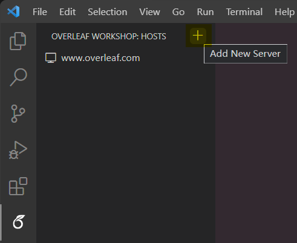
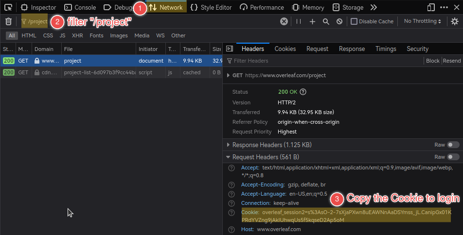
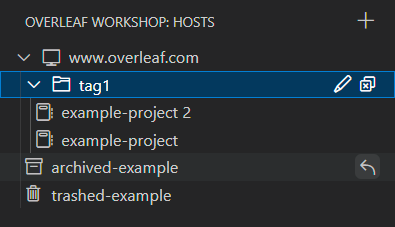
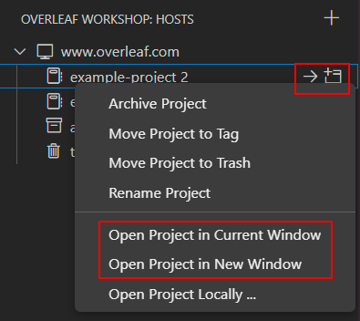
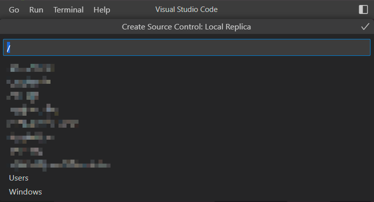

# Overleaf Workshop Wiki

Overleaf Workshop is an open-source extension for Overleaf users to manage projects, edit documents, and collaborate in Visual Studio Code.
The name of the extension is inspired by the well-known [LaTeX Workshop Extension](https://github.com/James-Yu/LaTeX-Workshop).

The aim of Overleaf Workshop is to provide a seamless experience for Overleaf users to enjoy the service of Overleaf in VS Code just like in the web browser, while benefiting from the powerful features and extensions of VS Code.

## Servers Management
Besides the official Overleaf server provided on [https://www.overleaf.com](https://www.overleaf.com), we also support the access to self-hosted [Overleaf Community Edition](https://github.com/overleaf/overleaf/wiki) and [Overleaf Server Pro Edition](https://www.overleaf.com/for/enterprises) servers.

> [!WARNING]
> Notice that the official server (with premium features) and Server Pro Edition are neither free nor open-source, the feature support for these servers is limited.
> All these extra features are marked with `Pro` in the following sections.

### Add New Server

Navigate to the extension page on the Activity Bar, you can see a default server `www.overleaf.com` in the hosts list with a fresh installation of the extension. It is unremovable until you add a new server.

To add a new server, click the `Add New Server` button on the top of the hosts list title as below.

Then a input box will pop up, enter the server URL and press `Enter` to confirm to add the server.

 The server URL should be exact the same as the home page URL of the server. Here are some notes:
- The URL should always start with `https://` or `http://`.
- The `www` subdomain is non-negligible, e.g., `https://overleaf.com` is not valid.
- The unnecessary path of the URL should be removed, e.g., `https://www.overleaf.com/project` should be `https://www.overleaf.com`.

### Remove Server

To remove a server, right click the server in the hosts list and select `Remove Server` in the context menu. There will be a confirmation dialog to confirm the removal.

Notice that if you have logged in to the server, the login information will be removed as well, which is not a logout action. That is to say, if you previously use cookies to login to the server, the cookies in the browser is still valid. If you want to also logout from the server while removing it, please remember to [logout from server](#logout-from-server) firstly before removing it.

### Login to Server

There are currently two ways to login to the server: login with email and password, and login with cookies.

> [!WARNING]
> According to the [open-source `passportLogin` design](https://github.com/overleaf/overleaf/blob/5fc2535842b2727cb1ec33ed5543ca614b4fc25b/services/web/app/src/Features/Authentication/AuthenticationController.js#L79) and observation of the login process, the email and password are sent to the server in ***plain text***, which implies that the server can ***see your password*** even if the connection is encrypted.
> We highly suggest you aware of this risk and use a ***separate password*** for the server, or use [SSO login](https://www.overleaf.com/learn/how-to/Managing_your_Overleaf_emails_and_login_options#Logging_in_with_institutional_or_organizational_single_sign-on_(SSO)) instead.

> [!NOTE]
> We are working on the webview-based login feature (to be appeared in `v1.0.0`). Please stay tuned.

#### Login with Email and Password
If you can login via email and password on the web browser, you can also login via email and password in VS Code. The exception is that Captcha is enabled on the server, then you have to [login with cookies](#login-with-cookies) instead.

#### Login with Cookies
As for the cases that Captcha is enabled on the server, or you want to login with SSO, you have to login with cookies from an already logged-in browser. The steps are as follows:

1. Open "Developer Tools" (usually by pressing <kbd>F12</kbd>) and switch to the "Network" tab;

   Then, navigate to the Overleaf project page (e.g., `https://www.overleaf.com/project`) in the address bar.

2. Filter the listed items with `/project` and select the exact match.

3. Check the "Cookie" under "Request Headers" of the selected item and copy its value to login.
    > The format of the Cookie value would be like: `overleaf_session2=...` or `sharelatex.sid=...`

### Logout from Server

To logout from a server, hover on the logged-in server in the hosts list, then click the `Logout Server` button on the rightmost of the server name. There will be a confirmation dialog to confirm the logout. This action will remove the login information from the extension, and also invalidate the related cookies as a normal logout process.

### Refresh Project List

After login to a server, the project list will be automatically loaded, together with your email address displayed aside. If there is any external change (not via the extension) to the project list, you can hover on the server, then click the `Refresh Project List` button to refresh the whole project list.

## Projects Management

### Create New Project

Hover on the server, then click the `New Project` button to create a new project.
There are currently three ways to create a new project: **Blank Project**, **Example Project**, and **Upload Project** (via local archive).

### Archive / Trash / Delete Project

As shown in the screenshot in the previous section, the normal / archived / trashed projects are displayed with different icons. You can right click on a project to (un)archive or (un)trash it.
Only trashed projects can be deleted, which means the project will be permanently removed from the server.

For explicit transition rules, please refer to the following graph:
> The solid lines indicate the action is available in the context menu, while the dashed lines indicate the action is available when hovered.
```mermaid
graph LR;

Normal-->Archived
Normal-->Trashed

Archived-->Trashed
Archived-.->Normal

Trashed-->Archived
Trashed-.->Normal

Trashed-.->Deleted
```

### Rename Project

Right click on a project to rename it. The project name should be unique in the server.

### Project Tag Management
To create a new tag, right click on the server and select `Create New Tag` in the context menu.

The project tags are displayed as folders in the project list.
The move a project in/out a tag, right click on the project and select `Move Project to Tag` / `Remove Project from Tag` in the context menu.
You can hover on an existing tag to rename or delete it. The projects under the deleted tag will be displayed outside automatically.

As the tags are treated as folders in philosophy, one project can only be in (added) one tag at a time.
If you want to add a project to multiple tags, please manage the tags on the web browser.

### Open Project

#### Open Project in Current/New Window

The Overleaf Workshop extension by default will open you project in a [virtual workspace](https://code.visualstudio.com/api/extension-guides/virtual-workspaces), just like the [WSL Extension](https://marketplace.visualstudio.com/items?itemName=ms-vscode-remote.remote-wsl).
You can choose to open the project in the current window or a new window. If you open the project in the current window, the current workspace will be replaced with the corresponding virtual workspace of the project.

However, due to the [limitation of the virtual workspace](https://github.com/microsoft/vscode/wiki/Virtual-Workspaces#signal-whether-your-extension-can-handle-virtual-workspaces), most of the existing VS Code extensions does not work in the virtual workspace. Meanwhile, the Overleaf Workshop extension is still under active development, and cannot compete with the matured [LaTeX Workshop Extension](https://github.com/James-Yu/LaTeX-Workshop) in terms of features and stability. In this case, you can choose to open the project locally.

#### Open Project Locally

> [!NOTE]
> The Overleaf features are not completely enabled in a local folder. Specifically, the [compile](#compile-project), [PDF preview](#preview-document), [intellisense](#intellisense) and [project history](#history-of-changes) features are disabled by default.
> 
> Currently, there is no way to enable these features in a local folder, especially considering people would like to use the LaTeX Workshop extension in a local folder. If you are in demand of these features, please consider to create a discussion in the [GitHub Discussions](https://github.com/iamhyc/Overleaf-Workshop/discussions)

The "Open Project Locally" feature is provided via a [local replica](#local-replica). The local replica is a folder on your local machine with a `.overleaf` folder presence, which is kept in sync with the project on the Overleaf server.

Please follow the steps below to setup a local replica and open the project locally:
1. Right click on the project and select `Open Project Locally...` in the context menu. A dialog will pop up to ask you to select a folder to create the local replica, if you have not created one before.

    

2. After confirm to create the local replica, a input box will pop up to ask you to choose the local parent folder to store the local replica. The auto-completion is supported with the start path as the root filesystem `/` (for Windows, it is actually `C:\`).

    When the parent folder path is chosen, please click the `Check` button on the right upper corner to submit the path. Please make sure the parent folder is writable and the local replica path will be created under the parent folder as `${parentFolder}/${projectName}`. If the local replica path already exists, it will be overwritten.

    

3. After the local replica is created, a input box will pop up to ask you to choose the local replica folder to open. Then you can open the project locally.

## Basic Usage

### Files Management

### Compile Project
The default output folder is `.output` in the project root directory. It is a ***virtual folder***, which does not actually exist in the project directory. You can change the name of the output folder in the project settings.

#### Compiler Diagnostics

#### Change the Compiler

### Preview Document
`pdf.js`

#### SyncTeX and Reverse SyncTeX

#### Themes

### Intellisense

#### Document Outline

#### Auto Completion

#### Spell Check

#### Code Prettify

### Collaboration

#### Collaborators Information

#### Chat with Collaborators

#### History of Changes

## Advanced Usage

### Local Replica

### Invisible Mode

### Commands and Shortcuts

### Configurations

## FAQ

#### Q: How to compile and show the compiled PDF?

#### Q: Why the plugin (e.g., `texlint`) does not work?

#### Q: Why the connection to overleaf server re-connects frequently?
